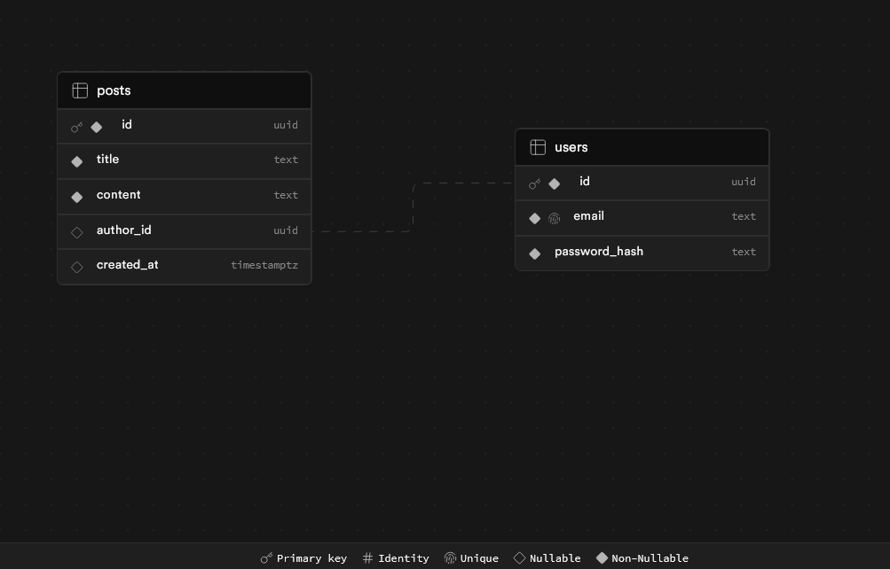

# Blogify Attack Capital - Backend

This is the backend service for the Blogify Attack Capital project. It is built with Node.js, Express, and TypeScript.

## Table of Contents

- [Getting Started](#getting-started)
- [Project Structure](#project-structure)
- [Scripts](#scripts)
- [Environment Variables](#environment-variables)
- [Dependencies](#dependencies)
- [Schema Design](#schema-design)
- [API Endpoints](#api-endpoint-nodejs-express-ts)


## Getting Started

To get started with the backend service, follow these steps:

1. **Clone the repository:**

    ```bash
    git clone https://github.com/your-repo/blogify-attack-capital.git
    cd blogify-attack-capital/backend
    ```

2. **Install dependencies:**

    ```bash
    npm install
    ```

3. **Set up environment variables:**

    Copy the `.env.example` file to `.env` and fill in the required values.

    ```bash
    cp .env.example .env
    ```

4. **Run the development server:**

    ```bash
    npm run dev
    ```

## Project Structure

The project structure is as follows:

```
backend/
├── src/
│   ├── config/
│   │   └── supabase.ts
│   ├── controllers/
│   │   ├── authController.ts
│   │   └── postController.ts
│   ├── middlewares/
│   │   └── auth.ts
│   ├── models/
│   │   ├── User.ts
│   │   └── Post.ts
│   ├── routes/
│   │   ├── auth.ts
│   │   └── posts.ts
│   ├── schemas/
│   │   ├── userSchema.ts
│   │   └── postSchema.ts
│   └── app.ts
├── .env
├── package.json
└── tsconfig.json
```


- **config**: Configuration files.
- **controllers**: Route controllers.
- **middlewares**: Express middlewares.
- **models**: Database models.
- **routes**: Express routes.
- **schemas**: Validation schemas.
- **app.ts**: Entry point of the application.

## Scripts

The following scripts are available in the [`package.json`](command:_github.copilot.openRelativePath?%5B%7B%22scheme%22%3A%22file%22%2C%22authority%22%3A%22%22%2C%22path%22%3A%22%2Fc%3A%2FUsers%2Faayum%2FOneDrive%2FDesktop%2FJob%2Fattack_capital%2Fblogify-attack-capital%2Fbackend%2Fpackage.json%22%2C%22query%22%3A%22%22%2C%22fragment%22%3A%22%22%7D%5D "c:\Users\aayum\OneDrive\Desktop\Job\attack_capital\blogify-attack-capital\backend\package.json") file:

- [`start`](command:_github.copilot.openSymbolFromReferences?%5B%22start%22%2C%5B%7B%22uri%22%3A%7B%22%24mid%22%3A1%2C%22fsPath%22%3A%22c%3A%5C%5CUsers%5C%5Caayum%5C%5COneDrive%5C%5CDesktop%5C%5CJob%5C%5Cattack_capital%5C%5Cblogify-attack-capital%5C%5Cbackend%5C%5Cpackage.json%22%2C%22_sep%22%3A1%2C%22external%22%3A%22file%3A%2F%2F%2Fc%253A%2FUsers%2Faayum%2FOneDrive%2FDesktop%2FJob%2Fattack_capital%2Fblogify-attack-capital%2Fbackend%2Fpackage.json%22%2C%22path%22%3A%22%2Fc%3A%2FUsers%2Faayum%2FOneDrive%2FDesktop%2FJob%2Fattack_capital%2Fblogify-attack-capital%2Fbackend%2Fpackage.json%22%2C%22scheme%22%3A%22file%22%7D%2C%22pos%22%3A%7B%22line%22%3A6%2C%22character%22%3A5%7D%7D%2C%7B%22uri%22%3A%7B%22%24mid%22%3A1%2C%22fsPath%22%3A%22c%3A%5C%5CUsers%5C%5Caayum%5C%5COneDrive%5C%5CDesktop%5C%5CJob%5C%5Cattack_capital%5C%5Cblogify-attack-capital%5C%5Cclient%5C%5Cpackage.json%22%2C%22_sep%22%3A1%2C%22external%22%3A%22file%3A%2F%2F%2Fc%253A%2FUsers%2Faayum%2FOneDrive%2FDesktop%2FJob%2Fattack_capital%2Fblogify-attack-capital%2Fclient%2Fpackage.json%22%2C%22path%22%3A%22%2Fc%3A%2FUsers%2Faayum%2FOneDrive%2FDesktop%2FJob%2Fattack_capital%2Fblogify-attack-capital%2Fclient%2Fpackage.json%22%2C%22scheme%22%3A%22file%22%7D%2C%22pos%22%3A%7B%22line%22%3A7%2C%22character%22%3A5%7D%7D%2C%7B%22uri%22%3A%7B%22%24mid%22%3A1%2C%22fsPath%22%3A%22c%3A%5C%5CUsers%5C%5Caayum%5C%5COneDrive%5C%5CDesktop%5C%5CJob%5C%5Cattack_capital%5C%5Cblogify-attack-capital%5C%5Cclient%5C%5CREADME.md%22%2C%22_sep%22%3A1%2C%22external%22%3A%22file%3A%2F%2F%2Fc%253A%2FUsers%2Faayum%2FOneDrive%2FDesktop%2FJob%2Fattack_capital%2Fblogify-attack-capital%2Fclient%2FREADME.md%22%2C%22path%22%3A%22%2Fc%3A%2FUsers%2Faayum%2FOneDrive%2FDesktop%2FJob%2Fattack_capital%2Fblogify-attack-capital%2Fclient%2FREADME.md%22%2C%22scheme%22%3A%22file%22%7D%2C%22pos%22%3A%7B%22line%22%3A18%2C%22character%22%3A8%7D%7D%5D%5D "Go to definition"): Start the application.
- [`build`](command:_github.copilot.openSymbolFromReferences?%5B%22build%22%2C%5B%7B%22uri%22%3A%7B%22%24mid%22%3A1%2C%22fsPath%22%3A%22c%3A%5C%5CUsers%5C%5Caayum%5C%5COneDrive%5C%5CDesktop%5C%5CJob%5C%5Cattack_capital%5C%5Cblogify-attack-capital%5C%5C.gitignore%22%2C%22_sep%22%3A1%2C%22external%22%3A%22file%3A%2F%2F%2Fc%253A%2FUsers%2Faayum%2FOneDrive%2FDesktop%2FJob%2Fattack_capital%2Fblogify-attack-capital%2F.gitignore%22%2C%22path%22%3A%22%2Fc%3A%2FUsers%2Faayum%2FOneDrive%2FDesktop%2FJob%2Fattack_capital%2Fblogify-attack-capital%2F.gitignore%22%2C%22scheme%22%3A%22file%22%7D%2C%22pos%22%3A%7B%22line%22%3A16%2C%22character%22%3A1%7D%7D%2C%7B%22uri%22%3A%7B%22%24mid%22%3A1%2C%22fsPath%22%3A%22c%3A%5C%5CUsers%5C%5Caayum%5C%5COneDrive%5C%5CDesktop%5C%5CJob%5C%5Cattack_capital%5C%5Cblogify-attack-capital%5C%5Cbackend%5C%5C.gitignore%22%2C%22_sep%22%3A1%2C%22external%22%3A%22file%3A%2F%2F%2Fc%253A%2FUsers%2Faayum%2FOneDrive%2FDesktop%2FJob%2Fattack_capital%2Fblogify-attack-capital%2Fbackend%2F.gitignore%22%2C%22path%22%3A%22%2Fc%3A%2FUsers%2Faayum%2FOneDrive%2FDesktop%2FJob%2Fattack_capital%2Fblogify-attack-capital%2Fbackend%2F.gitignore%22%2C%22scheme%22%3A%22file%22%7D%2C%22pos%22%3A%7B%22line%22%3A16%2C%22character%22%3A1%7D%7D%2C%7B%22uri%22%3A%7B%22%24mid%22%3A1%2C%22fsPath%22%3A%22c%3A%5C%5CUsers%5C%5Caayum%5C%5COneDrive%5C%5CDesktop%5C%5CJob%5C%5Cattack_capital%5C%5Cblogify-attack-capital%5C%5Cbackend%5C%5Cpackage.json%22%2C%22_sep%22%3A1%2C%22external%22%3A%22file%3A%2F%2F%2Fc%253A%2FUsers%2Faayum%2FOneDrive%2FDesktop%2FJob%2Fattack_capital%2Fblogify-attack-capital%2Fbackend%2Fpackage.json%22%2C%22path%22%3A%22%2Fc%3A%2FUsers%2Faayum%2FOneDrive%2FDesktop%2FJob%2Fattack_capital%2Fblogify-attack-capital%2Fbackend%2Fpackage.json%22%2C%22scheme%22%3A%22file%22%7D%2C%22pos%22%3A%7B%22line%22%3A7%2C%22character%22%3A5%7D%7D%2C%7B%22uri%22%3A%7B%22%24mid%22%3A1%2C%22fsPath%22%3A%22c%3A%5C%5CUsers%5C%5Caayum%5C%5COneDrive%5C%5CDesktop%5C%5CJob%5C%5Cattack_capital%5C%5Cblogify-attack-capital%5C%5Cclient%5C%5C.gitignore%22%2C%22_sep%22%3A1%2C%22external%22%3A%22file%3A%2F%2F%2Fc%253A%2FUsers%2Faayum%2FOneDrive%2FDesktop%2FJob%2Fattack_capital%2Fblogify-attack-capital%2Fclient%2F.gitignore%22%2C%22path%22%3A%22%2Fc%3A%2FUsers%2Faayum%2FOneDrive%2FDesktop%2FJob%2Fattack_capital%2Fblogify-attack-capital%2Fclient%2F.gitignore%22%2C%22scheme%22%3A%22file%22%7D%2C%22pos%22%3A%7B%22line%22%3A16%2C%22character%22%3A1%7D%7D%2C%7B%22uri%22%3A%7B%22%24mid%22%3A1%2C%22fsPath%22%3A%22c%3A%5C%5CUsers%5C%5Caayum%5C%5COneDrive%5C%5CDesktop%5C%5CJob%5C%5Cattack_capital%5C%5Cblogify-attack-capital%5C%5Cclient%5C%5Cpackage.json%22%2C%22_sep%22%3A1%2C%22external%22%3A%22file%3A%2F%2F%2Fc%253A%2FUsers%2Faayum%2FOneDrive%2FDesktop%2FJob%2Fattack_capital%2Fblogify-attack-capital%2Fclient%2Fpackage.json%22%2C%22path%22%3A%22%2Fc%3A%2FUsers%2Faayum%2FOneDrive%2FDesktop%2FJob%2Fattack_capital%2Fblogify-attack-capital%2Fclient%2Fpackage.json%22%2C%22scheme%22%3A%22file%22%7D%2C%22pos%22%3A%7B%22line%22%3A6%2C%22character%22%3A5%7D%7D%5D%5D "Go to definition"): Compile TypeScript to JavaScript.
- [`dev`](command:_github.copilot.openSymbolFromReferences?%5B%22dev%22%2C%5B%7B%22uri%22%3A%7B%22%24mid%22%3A1%2C%22fsPath%22%3A%22c%3A%5C%5CUsers%5C%5Caayum%5C%5COneDrive%5C%5CDesktop%5C%5CJob%5C%5Cattack_capital%5C%5Cblogify-attack-capital%5C%5Cbackend%5C%5Cpackage.json%22%2C%22_sep%22%3A1%2C%22external%22%3A%22file%3A%2F%2F%2Fc%253A%2FUsers%2Faayum%2FOneDrive%2FDesktop%2FJob%2Fattack_capital%2Fblogify-attack-capital%2Fbackend%2Fpackage.json%22%2C%22path%22%3A%22%2Fc%3A%2FUsers%2Faayum%2FOneDrive%2FDesktop%2FJob%2Fattack_capital%2Fblogify-attack-capital%2Fbackend%2Fpackage.json%22%2C%22scheme%22%3A%22file%22%7D%2C%22pos%22%3A%7B%22line%22%3A8%2C%22character%22%3A5%7D%7D%2C%7B%22uri%22%3A%7B%22%24mid%22%3A1%2C%22fsPath%22%3A%22c%3A%5C%5CUsers%5C%5Caayum%5C%5COneDrive%5C%5CDesktop%5C%5CJob%5C%5Cattack_capital%5C%5Cblogify-attack-capital%5C%5Cclient%5C%5Cpackage.json%22%2C%22_sep%22%3A1%2C%22external%22%3A%22file%3A%2F%2F%2Fc%253A%2FUsers%2Faayum%2FOneDrive%2FDesktop%2FJob%2Fattack_capital%2Fblogify-attack-capital%2Fclient%2Fpackage.json%22%2C%22path%22%3A%22%2Fc%3A%2FUsers%2Faayum%2FOneDrive%2FDesktop%2FJob%2Fattack_capital%2Fblogify-attack-capital%2Fclient%2Fpackage.json%22%2C%22scheme%22%3A%22file%22%7D%2C%22pos%22%3A%7B%22line%22%3A5%2C%22character%22%3A5%7D%7D%2C%7B%22uri%22%3A%7B%22%24mid%22%3A1%2C%22fsPath%22%3A%22c%3A%5C%5CUsers%5C%5Caayum%5C%5COneDrive%5C%5CDesktop%5C%5CJob%5C%5Cattack_capital%5C%5Cblogify-attack-capital%5C%5Cclient%5C%5CREADME.md%22%2C%22_sep%22%3A1%2C%22external%22%3A%22file%3A%2F%2F%2Fc%253A%2FUsers%2Faayum%2FOneDrive%2FDesktop%2FJob%2Fattack_capital%2Fblogify-attack-capital%2Fclient%2FREADME.md%22%2C%22path%22%3A%22%2Fc%3A%2FUsers%2Faayum%2FOneDrive%2FDesktop%2FJob%2Fattack_capital%2Fblogify-attack-capital%2Fclient%2FREADME.md%22%2C%22scheme%22%3A%22file%22%7D%2C%22pos%22%3A%7B%22line%22%3A4%2C%22character%22%3A15%7D%7D%5D%5D "Go to definition"): Start the development server with hot-reloading.

## Environment Variables

The following environment variables are required:

- `PORT`: The port on which the server will run.
- `SESSION_SECRET`: A secret key used for session management.
- `JWT_SECRET`: A secret key used for signing JSON Web Tokens.
- `SUPABASE_URL`: The URL of the Supabase instance.
- `SUPABASE_ANON_KEY`: The anonymous key for accessing Supabase.


## Dependencies

- **express**: Web framework for Node.js.
- **dotenv**: Loads environment variables from a [`.env`](command:_github.copilot.openSymbolFromReferences?%5B%22.env%22%2C%5B%7B%22uri%22%3A%7B%22%24mid%22%3A1%2C%22fsPath%22%3A%22c%3A%5C%5CUsers%5C%5Caayum%5C%5COneDrive%5C%5CDesktop%5C%5CJob%5C%5Cattack_capital%5C%5Cblogify-attack-capital%5C%5C.gitignore%22%2C%22_sep%22%3A1%2C%22external%22%3A%22file%3A%2F%2F%2Fc%253A%2FUsers%2Faayum%2FOneDrive%2FDesktop%2FJob%2Fattack_capital%2Fblogify-attack-capital%2F.gitignore%22%2C%22path%22%3A%22%2Fc%3A%2FUsers%2Faayum%2FOneDrive%2FDesktop%2FJob%2Fattack_capital%2Fblogify-attack-capital%2F.gitignore%22%2C%22scheme%22%3A%22file%22%7D%2C%22pos%22%3A%7B%22line%22%3A28%2C%22character%22%3A0%7D%7D%2C%7B%22uri%22%3A%7B%22%24mid%22%3A1%2C%22fsPath%22%3A%22c%3A%5C%5CUsers%5C%5Caayum%5C%5COneDrive%5C%5CDesktop%5C%5CJob%5C%5Cattack_capital%5C%5Cblogify-attack-capital%5C%5Cbackend%5C%5Clayout.txt%22%2C%22_sep%22%3A1%2C%22external%22%3A%22file%3A%2F%2F%2Fc%253A%2FUsers%2Faayum%2FOneDrive%2FDesktop%2FJob%2Fattack_capital%2Fblogify-attack-capital%2Fbackend%2Flayout.txt%22%2C%22path%22%3A%22%2Fc%3A%2FUsers%2Faayum%2FOneDrive%2FDesktop%2FJob%2Fattack_capital%2Fblogify-attack-capital%2Fbackend%2Flayout.txt%22%2C%22scheme%22%3A%22file%22%7D%2C%22pos%22%3A%7B%22line%22%3A19%2C%22character%22%3A4%7D%7D%2C%7B%22uri%22%3A%7B%22%24mid%22%3A1%2C%22fsPath%22%3A%22c%3A%5C%5CUsers%5C%5Caayum%5C%5COneDrive%5C%5CDesktop%5C%5CJob%5C%5Cattack_capital%5C%5Cblogify-attack-capital%5C%5Cclient%5C%5C.gitignore%22%2C%22_sep%22%3A1%2C%22external%22%3A%22file%3A%2F%2F%2Fc%253A%2FUsers%2Faayum%2FOneDrive%2FDesktop%2FJob%2Fattack_capital%2Fblogify-attack-capital%2Fclient%2F.gitignore%22%2C%22path%22%3A%22%2Fc%3A%2FUsers%2Faayum%2FOneDrive%2FDesktop%2FJob%2Fattack_capital%2Fblogify-attack-capital%2Fclient%2F.gitignore%22%2C%22scheme%22%3A%22file%22%7D%2C%22pos%22%3A%7B%22line%22%3A28%2C%22character%22%3A0%7D%7D%5D%5D "Go to definition") file.

- **@supabase/supabase-js@2.45.1**: Supabase client library.
- **@types/bcrypt@5.0.2**: Type definitions for bcrypt.
- **@types/jsonwebtoken@9.0.6**: Type definitions for jsonwebtoken.
- **bcrypt@5.1.1**: Library for hashing passwords.
- **express-session@1.18.0**: Middleware for session management.
- **jsonwebtoken@9.0.2**: Library for JWT-based authentication.
- **zod@3.23.8**: TypeScript-first schema declaration and validation library.


## Schema Design



## API Endpoint (NodeJS/ Express/ TS)

1. **POST /signup**
   - **Description**: Registers a new user with their email and password.
   - **Request Body**:
     ```json
     {
       "email": "user@example.com",
       "password": "securepassword"
     }
     ```
   - **Response**:
     - **201 Created**: User successfully registered.
     - **400 Bad Request**: Invalid input or email already in use.

2. **POST /login**
   - **Description**: Authenticates a user and returns a session token.
   - **Request Body**:
     ```json
     {
       "email": "user@example.com",
       "password": "securepassword"
     }
     ```
   - **Response**:
     - **200 OK**: Authentication successful, returns JWT token.
     - **401 Unauthorized**: Invalid email or password.

3. **POST /post**
   - **Description**: Allows authenticated users to post a new article.
   - **Request Headers**: 
     ```json
     {
       "Authorization": "Bearer <token>"
     }
     ```
   - **Request Body**:
     ```json
     {
       "title": "My First Post",
       "content": "This is the content of my first post."
     }
     ```
   - **Response**:
     - **201 Created**: Post successfully created.
     - **401 Unauthorized**: Missing or invalid token.

4. **GET /posts**
   - **Description**: Retrieves all posts.
   - **Response**:
     - **200 OK**: List of all posts.

5. **GET /posts?author=userId**
   - **Description**: Retrieves posts by a specific author.
   - **Query Parameters**:
     - `author`: User ID of the author.
   - **Response**:
     - **200 OK**: List of posts by the specified author.

#### Data Models

1. **User**
   - **Fields**:
     - `id`: Unique identifier for the user.
     - `email`: User's email address.
     - `passwordHash`: Hashed password for secure storage.

2. **Post**
   - **Fields**:
     - `id`: Unique identifier for the post.
     - `title`: Title of the post.
     - `content`: Content of the post.
     - `authorId`: ID of the user who authored the post.
     - `createdAt`: Timestamp when the post was created.

#### Authentication

- **JWT-based Authentication**:
  - Implement JSON Web Token (JWT) for secure user authentication.
  - Tokens are issued upon successful login and must be included in the Authorization header for endpoints that require authentication.

- **Secure Password Storage**:
  - Store passwords as hashed values using a strong hashing algorithm (e.g., bcrypt) to ensure security.

This backend architecture ensures robust user authentication and secure handling of user data, providing a solid foundation for a web application.
